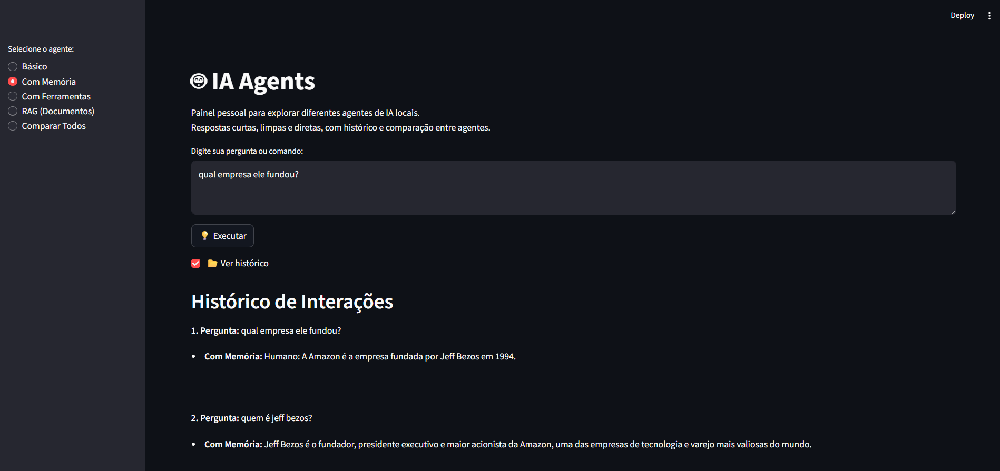
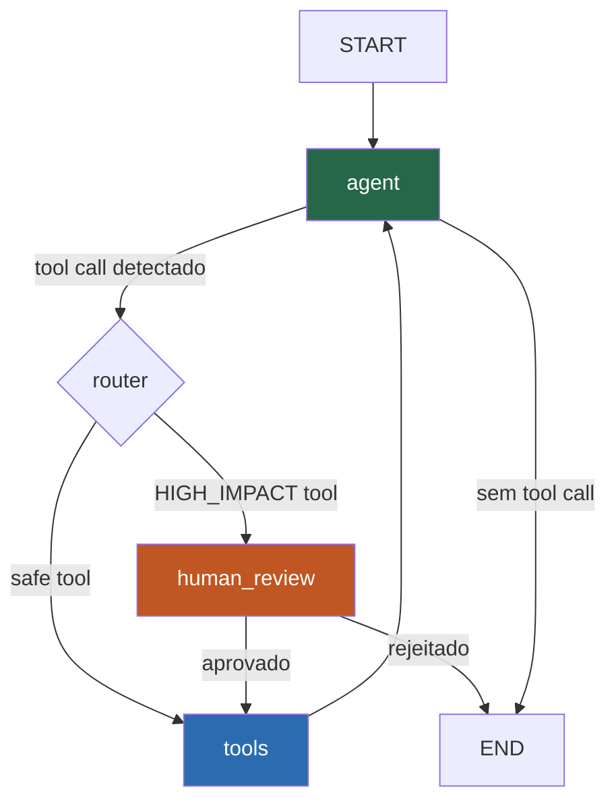

# agents-AI

Painel Streamlit para explorar e comparar agentes de IA com múltiplos providers: **Ollama** (local), **Claude** (Anthropic) e **OpenAI**.

Demonstra padrões de produção: LCEL chains, `create_react_agent` (LangGraph), **Human-in-the-Loop** com `interrupt()`, **servidor MCP customizado** e **evals com LLM-as-judge**.



---

## Arquitetura do agente com ferramentas (LangGraph)



| Componente | Responsabilidade |
|---|---|
| **agent** | Invoca LLM com ferramentas vinculadas (LCEL + bind_tools) |
| **router** | Verifica se o tool call é de alto impacto |
| **human_review** | `interrupt()` — pausa, aguarda aprovação, retoma via `Command(resume=...)` |
| **tools** | `ToolNode` — executa a ferramenta e retorna o resultado ao agente |

---

## Agentes disponíveis

| Agente | Descrição | Padrão |
|---|---|---|
| Básico | Responde perguntas gerais | LCEL chain simples |
| Com Memória | Mantém contexto da conversa | `RunnableWithMessageHistory` |
| Com Ferramentas | Executa tools (soma, data atual) | `create_react_agent` (LangGraph) |
| RAG | Consulta documentos em `data/docs/` | LCEL RAG chain + FAISS |
| **HITL** | Pausa para aprovação em ações de alto impacto | LangGraph `interrupt()` + `MemorySaver` |

---

## MCP Server

`mcp_server.py` implementa um servidor MCP customizado que expõe 4 ferramentas:

| Ferramenta | O que faz |
|---|---|
| `get_current_datetime` | Data/hora UTC em ISO 8601 |
| `calculate` | Avalia expressões matemáticas com segurança |
| `search_knowledge` | Busca no knowledge base (stub — conecte ao seu Qdrant) |
| `count_tokens` | Estimativa de tokens em um texto |

**Para rodar o servidor:**
```bash
pip install mcp
python mcp_server.py
```

**Para conectar ao Claude Desktop**, adicione em `claude_desktop_config.json`:
```json
{
  "mcpServers": {
    "agents-ai": {
      "command": "python",
      "args": ["/caminho/para/mcp_server.py"]
    }
  }
}
```

---

## Providers suportados

| Provider | Modelo | Requer |
|---|---|---|
| `ollama` | llama3 | [Ollama](https://ollama.ai) instalado |
| `claude` | claude-3-5-haiku-20241022 | `ANTHROPIC_API_KEY` no `.env` |
| `openai` | gpt-4o-mini | `OPENAI_API_KEY` no `.env` |

---

## Estrutura

```text
.
├── main.py                   # Dashboard Streamlit
├── mcp_server.py             # Servidor MCP customizado (stdio transport)
├── agents/
│   ├── provider.py           # Fábrica de LLMs por provider
│   ├── basic_agent.py        # LCEL chain simples
│   ├── memory_agent.py       # RunnableWithMessageHistory
│   ├── tool_agent.py         # LangGraph ReAct + tools
│   ├── rag_agent.py          # LCEL RAG + FAISS
│   └── hitl_agent.py         # LangGraph interrupt() + MemorySaver ← novo
├── evals/
│   ├── evaluate.py           # Harness LLM-as-judge
│   └── dataset.json          # Dataset de regressão
├── data/docs/                # Coloque seus .txt aqui para o agente RAG
├── requirements.txt
└── LICENSE
```

---

## Quick start

```bash
git clone https://github.com/RenanMiqueloti/agents-AI.git
cd agents-AI
python -m venv .venv
# Windows: .venv\Scripts\activate | Linux/Mac: source .venv/bin/activate
pip install -r requirements.txt
```

Crie `.env` com as chaves que for usar:

```env
ANTHROPIC_API_KEY=sk-ant-...
OPENAI_API_KEY=sk-...
```

```bash
# Ollama: garanta que o modelo está disponível
ollama pull llama3

# Painel Streamlit
streamlit run main.py

# HITL demo (terminal)
python -m agents.hitl_agent

# Evals
python -m evals.evaluate
```

---

## Evals

O harness em `evals/evaluate.py` avalia cada agente com LLM-as-judge em três dimensões:

| Dimensão | O que mede |
|---|---|
| `correctness` | A resposta está factualmente correta? |
| `helpfulness` | A resposta realmente ajuda o usuário? |
| `conciseness` | A resposta é breve sem perder informação? |

Os resultados são salvos em `evals/results.json` para rastreamento de regressão.

---

## Design decisions

**Por que LangGraph e não CrewAI?**
LangGraph venceu CrewAI em stars do GitHub em early 2026 por uma razão concreta: reducer-based state management. Cada nó declara como atualiza o estado; conflitos em execuções paralelas são resolvidos deterministicamente. CrewAI abstrai isso — útil em demos, problemático em produção com audit trail.

**Por que `interrupt()` e não polling?**
`interrupt()` serializa o grafo completo via checkpointer (MemorySaver em memória, PostgresSaver em produção). A execução retoma do ponto exato — não do início. Polling exigiria estado externo e re-execução parcial do grafo.

**Por que um servidor MCP customizado?**
Consumir MCP é commodity (78% das enterprises já têm agentes MCP em produção). *Implementar* um servidor MCP é raro. Este projeto demonstra os dois lados do protocolo.

**Por que FAISS no agente RAG e não Qdrant?**
FAISS é suficiente para demonstração local sem servidor extra. Para produção com filtros e escala horizontal, troque por Qdrant (ver `rag-chatbot` que já usa Qdrant in-memory).
