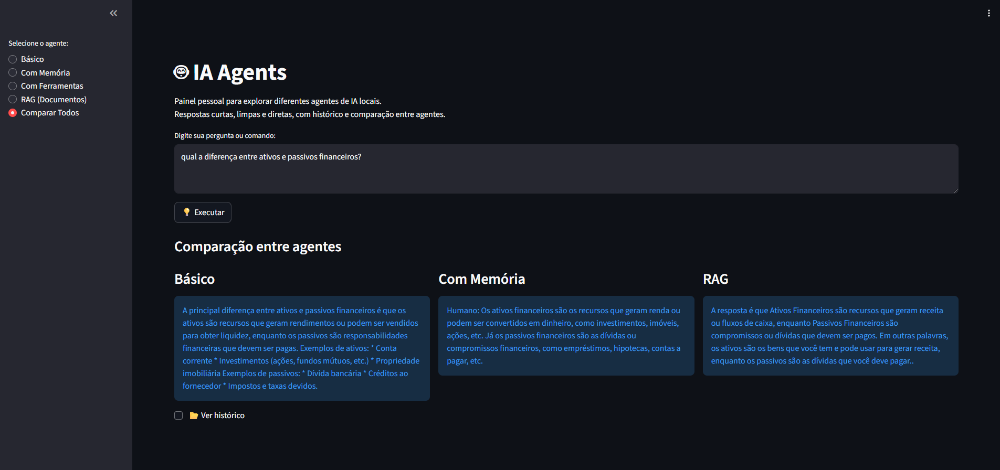

# 🤖 Agents AI Dashboard

Um painel pessoal para testar agentes de IA locais, 100% offline, usando Ollama + Llama3.  
Inclui 4 tipos de agentes: **Básico**, **Memória**, **Ferramentas** e **RAG (busca em documentos)**.

---

## 🧱 Estrutura do projeto

```
ai_agents_free/
├── main.py
├── agents/
│   ├── basic_agent.py
│   ├── memory_agent.py
│   ├── tool_agent.py
│   ├── rag_agent.py
├── data/
│   ├── docs/
│   │   └── exemplo.txt
└── requirements.txt
```

---

## ⚙️ Instalação

### 1. Clone o repositório:

```bash
git clone https://github.com/RenanMiqueloti/agents-AI
cd ai_agents_free
```

### 2. Instale o Ollama e baixe o modelo Llama3:

```bash
ollama pull llama3
```

### 3. Instale as dependências:

```bash
pip install -r requirements.txt
```

### 4. Execute o dashboard:

```bash
streamlit run main.py
```

Abra o navegador em [http://localhost:8501](http://localhost:8501).

---

## 🧠 Tipos de Agentes

| Agente             | Descrição |
|-------------------|-----------|
| Básico             | Responde perguntas gerais. |
| Com Memória        | Lembra o contexto da conversa na sessão atual. |
| Com Ferramentas    | Pode executar operações como somas numéricas. |
| RAG (Documentos)   | Busca informações em documentos locais (`data/docs/`). |

---

## 💡 Como usar

1. Selecione o tipo de agente na sidebar.  
2. Digite sua pergunta ou comando no campo de texto.  
3. Clique em 💡 **Executar**.  
4. Visualize o resultado ou compare todos os agentes lado a lado.  
5. Ative o histórico para acompanhar respostas anteriores.

---

## 📂 Exemplo de documentos (RAG)

Arquivo `data/docs/exemplo.txt`:

```
KPIs Q3 2025:
- Receita Total: R$ 15.200.000
- Lucro Líquido: R$ 3.450.000
- EBITDA: R$ 5.200.000
- Margem: 22,7%
- Tempo médio de processamento: 1,2 dias
```

---

## 📝 Exemplos de Prompts

| Prompt                                  | Agente       | Resultado Esperado |
|----------------------------------------|-------------|------------------|
| Quem é Elon Musk?                       | Básico      | Breve descrição do Elon Musk. |
| Quem é Elon Musk? / Qual empresa ele fundou? | Memória     | Lembra contexto anterior e responde corretamente. |
| Some 23 57                              | Ferramentas | Retorna 80. |
| Liste os KPIs do Q3 2025                | RAG         | Retorna os KPIs do documento, resumidos. |

---

## 📷 Imagens do Dashboard

**Tela principal**  

  

**Comparação entre agentes**  

  

*(Substitua as imagens pelos prints reais do seu Streamlit)*
