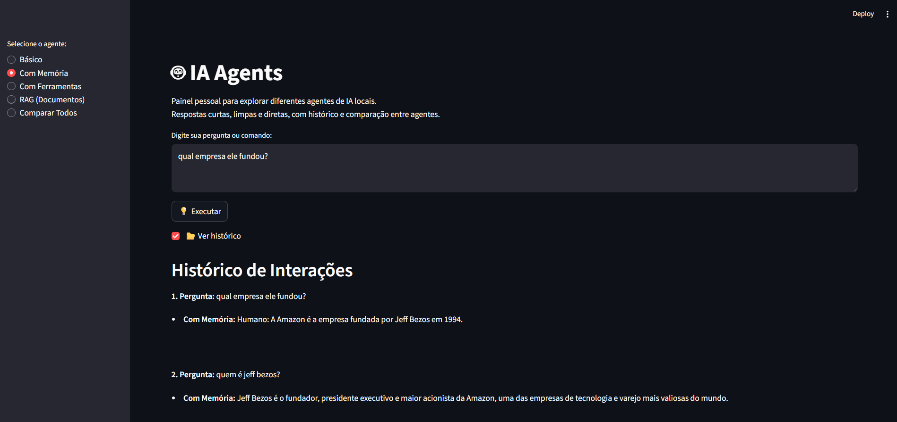
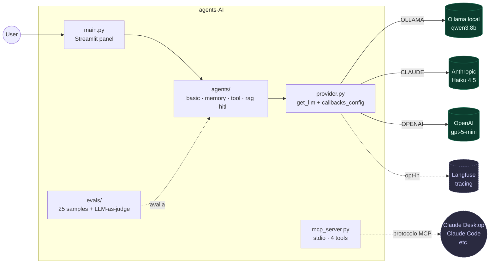
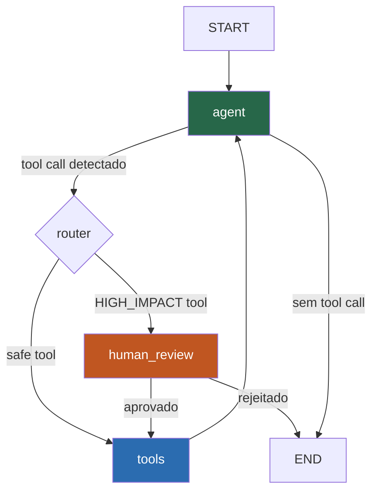
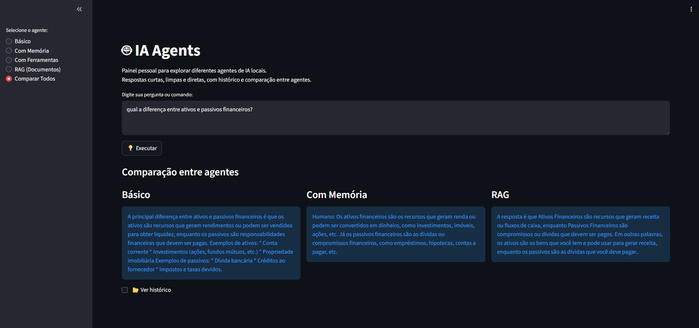
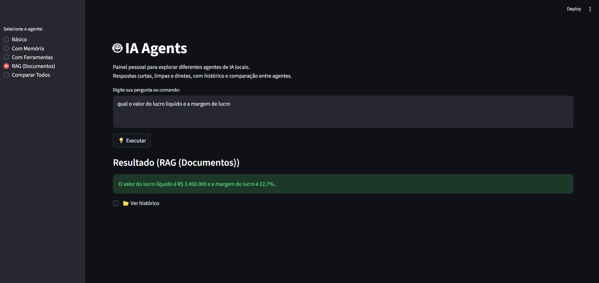

# agents-AI


Painel Streamlit multi-agente com LangGraph 0.4+, HITL via `interrupt()` + `MemorySaver`, servidor MCP customizado e harness de evals com LLM-as-judge. Providers: Ollama, Claude e OpenAI.



> Screenshots desta página são da v0.1 do painel; a versão atual também inclui o agente HITL na sidebar com fluxo `interrupt → aprovação → resume`.

---

## Visão geral

- **5 agentes** num único painel: básico, com memória, com ferramentas, RAG e HITL.
- **HITL real** — `interrupt()` pausa o grafo, `MemorySaver` serializa o estado, `Command(resume=...)` retoma do ponto exato.
- **Servidor MCP** próprio em [`mcp_server.py`](mcp_server.py): 4 ferramentas via stdio, conectável a Claude Desktop, Claude Code ou qualquer cliente MCP.
- **25 evals** com LLM-as-judge cobrindo todos os agentes, incluindo as três rotas do HITL (approve / reject / safe).
- **Tracing opt-in** via Langfuse — três variáveis de ambiente, sem alterar código.


```mermaid
flowchart LR
    User((User))

    subgraph Repo["agents-AI"]
      UI["main.py<br/>Streamlit panel"]
      Agents["agents/<br/>basic · memory · tool · rag · hitl"]
      Provider["provider.py<br/>get_llm + callbacks_config"]
      Evals["evals/<br/>25 samples + LLM-as-judge"]
      MCP["mcp_server.py<br/>stdio · 4 tools"]
    end

    User --> UI --> Agents --> Provider
    Evals -. avalia .-> Agents

    Provider -->|OLLAMA| Ollama[(Ollama local<br/>qwen3:8b)]
    Provider -->|CLAUDE| Anthropic[(Anthropic<br/>Haiku 4.5)]
    Provider -->|OPENAI| OpenAI[(OpenAI<br/>gpt-5-mini)]
    Provider -. opt-in .-> Langfuse[(Langfuse<br/>tracing)]

    MCP -. protocolo MCP .-> Clients(("Claude Desktop<br/>Claude Code<br/>etc."))

    classDef external fill:#0b3d2e,stroke:#1f6f54,color:#e6fff5;
    classDef optional fill:#2a2a40,stroke:#5a5a80,color:#cfcfff,stroke-dasharray:3 3;
    class Ollama,Anthropic,OpenAI external;
    class Langfuse,Clients optional;
```

> O painel chama os agentes, que delegam ao `provider` pra falar com o LLM escolhido. O harness de evals roda os mesmos agentes em batch. Linhas tracejadas (Langfuse, clientes MCP externos) são integrações opt-in.

---

## Quick start

```bash
git clone https://github.com/RenanMiqueloti/agents-AI.git
cd agents-AI
python -m venv .venv && source .venv/bin/activate    # Windows: .venv\Scripts\activate
pip install -r requirements.txt
```

Copie [`.env.example`](.env.example) para `.env` e preencha as keys dos providers que for usar:

```env
ANTHROPIC_API_KEY=sk-ant-...
OPENAI_API_KEY=sk-...
```

Para rodar com Ollama localmente:

```bash
ollama pull qwen3:8b           # chat model
ollama pull nomic-embed-text   # embeddings do agente RAG
```

Comandos principais:

```bash
streamlit run main.py            # painel multi-agente
python -m agents.hitl_agent      # demo HITL no terminal
python -m evals.evaluate         # roda os 25 evals (juiz: gpt-5-mini)
```

### Via Docker

```bash
docker compose up app                  # painel em http://localhost:8501
docker compose --profile ollama up     # painel + servidor Ollama containerizado
```

Configure as keys no `.env` antes. Sem `--profile ollama`, exporte `OLLAMA_HOST=http://host.docker.internal:11434` no `.env` para usar o Ollama da host machine (Docker Desktop).

---

## API HTTP

Para consumir os agentes fora do Streamlit, [`api/server.py`](api/server.py) expõe endpoints REST stateless. `memory` e `hitl` ficam fora — o primeiro tem estado por processo, o segundo precisa de streaming + `Command(resume=...)`.

```bash
uvicorn api.server:app --reload    # http://localhost:8000
```

| Endpoint | Descrição |
|---|---|
| `GET /health` | Liveness simples |
| `POST /agent/{name}` | `name ∈ {basic, tool, rag}`; body `{"prompt": str, "provider": "ollama"\|"claude"\|"openai"}` |

Exemplo:

```bash
curl -X POST http://localhost:8000/agent/basic \
     -H "Content-Type: application/json" \
     -d '{"prompt": "Qual a capital da França?", "provider": "openai"}'
```

OpenAPI interativa em `http://localhost:8000/docs`.

---

## Arquitetura HITL


```mermaid
graph TD
    START --> agent
    agent -->|"tool call detectado"| router{router}
    router -->|"HIGH_IMPACT tool"| human_review
    router -->|"safe tool"| tools
    human_review -->|"aprovado"| tools
    human_review -->|"rejeitado"| END
    tools --> agent
    agent -->|"sem tool call"| END

    style human_review fill:#c05621,color:#fff
    style tools fill:#2b6cb0,color:#fff
    style agent fill:#276749,color:#fff
```

| Componente | Responsabilidade |
|---|---|
| **agent** | Invoca o LLM com ferramentas vinculadas (`bind_tools`) |
| **router** | Decide se o tool call requer aprovação humana |
| **human_review** | `interrupt()` — pausa, aguarda decisão, retoma via `Command(resume=...)` |
| **tools** | `ToolNode` — executa a ferramenta e devolve o resultado ao agente |

Implementação em [`agents/hitl_agent.py`](agents/hitl_agent.py); UI integrada em [`main.py`](main.py).

---

## Agentes

| Agente | Descrição | Padrão |
|---|---|---|
| Básico | Responde perguntas gerais | LCEL chain simples |
| Com Memória | Mantém contexto da conversa | `RunnableWithMessageHistory` |
| Com Ferramentas | Executa tools (`soma`, `data_hoje`) | `create_react_agent` (LangGraph) |
| RAG | Consulta documentos em `data/docs/` | LCEL RAG chain + FAISS |
| **HITL** | Pausa para aprovação em ações de alto impacto | LangGraph `interrupt()` + `MemorySaver` |



> Modo "Comparar Todos" do painel: três agentes respondendo à mesma pergunta em paralelo — útil para mostrar diferença de comportamento entre LCEL puro, memória e RAG.

---

## Servidor MCP

[`mcp_server.py`](mcp_server.py) implementa um servidor MCP com 4 ferramentas via stdio. Conecta a qualquer cliente compatível — Claude Desktop, Claude Code ou um agente LangGraph com `MultiServerMCPClient`.

| Ferramenta | O que faz |
|---|---|
| `get_current_datetime` | Data/hora UTC em ISO 8601 |
| `calculate` | Avalia expressões matemáticas com namespace restrito |
| `search_knowledge` | Busca semântica em `data/docs/` (FAISS in-memory + `nomic-embed-text` via Ollama; lazy init na 1ª call) |
| `count_tokens` | Estimativa de tokens em um texto |

```bash
python mcp_server.py
```

Para conectar ao Claude Desktop, edite `claude_desktop_config.json`:

```json
{
  "mcpServers": {
    "agents-ai": {
      "command": "python",
      "args": ["/caminho/absoluto/para/mcp_server.py"]
    }
  }
}
```

---

## Providers

| Provider | Modelo padrão | Requer |
|---|---|---|
| `ollama` | `qwen3:8b` | [Ollama](https://ollama.ai) instalado |
| `claude` | `claude-haiku-4-5-20251001` | `ANTHROPIC_API_KEY` no `.env` |
| `openai` | `gpt-5-mini` | `OPENAI_API_KEY` no `.env` |

Os defaults estão em três constantes no topo de [`agents/provider.py`](agents/provider.py) — trocar é uma linha. O agente RAG usa Ollama (`nomic-embed-text`) para embeddings independentemente do chat model escolhido.

---

## Evals

[`evals/evaluate.py`](evals/evaluate.py) é um harness LLM-as-judge que executa os 25 samples de [`evals/dataset.json`](evals/dataset.json) e pontua cada resposta em três dimensões:

| Dimensão | O que mede |
|---|---|
| `correctness` | A resposta é factualmente correta? |
| `helpfulness` | A resposta efetivamente ajuda quem perguntou? |
| `conciseness` | É breve sem perder informação relevante? |

```bash
python -m evals.evaluate    # provider default: openai; juiz: gpt-5-mini
```

O resumo é impresso no stdout; o JSON completo (prompt, answer e scores por sample) é salvo em `evals/results.json` para rastreamento de regressão.

Cobertura HITL: três rotas simuladas pelo evaluator com `thread_id` único por sample — `hitl_approve`, `hitl_reject` e `hitl_safe` (esta última marca falha se um `interrupt()` for disparado indevidamente).

---

## Observability — Langfuse (opt-in)

Para tracing por execução (spans, custos, tokens, latência por nó do grafo), defina três variáveis no `.env`:

```env
LANGFUSE_PUBLIC_KEY=pk-lf-...
LANGFUSE_SECRET_KEY=sk-lf-...
LANGFUSE_HOST=https://cloud.langfuse.com   # opcional (default: cloud Langfuse)
```

Sem essas keys, os agentes funcionam idênticos. Com elas, todo `runnable.invoke(..., config=callbacks_config())` envia spans ao seu projeto Langfuse — instrumentado em `basic`, `memory`, `tool` e `rag`. O agente `hitl` ainda não está instrumentado por default (streaming + `interrupt()` exigem hook manual); o ponto de extensão é o helper [`callbacks_config`](agents/provider.py).

[Free tier do Langfuse →](https://langfuse.com)

---

## Deploy live (Hugging Face Spaces)

O painel Streamlit roda no [free tier do Hugging Face Spaces](https://huggingface.co/spaces) sem GPU — setup em ~5 min:

1. Crie um Space em [huggingface.co/new-space](https://huggingface.co/new-space) → SDK **Streamlit** → visibilidade **Public**.
2. No `README.md` do Space, cole o frontmatter:
   ```yaml
   ---
   title: agents-AI
   emoji: 🔌
   colorFrom: blue
   colorTo: indigo
   sdk: streamlit
   sdk_version: 1.35.0
   app_file: main.py
   pinned: false
   license: mit
   ---
   ```
3. Faça push deste repo para o remote do Space, ou ative **Sync from GitHub** na UI.
4. Em **Settings → Variables and secrets**, adicione `ANTHROPIC_API_KEY`, `OPENAI_API_KEY` e opcionalmente `LANGFUSE_PUBLIC_KEY` / `LANGFUSE_SECRET_KEY` / `LANGFUSE_HOST`.
5. Aguarde o build (~3-5 min). O Space fica em `huggingface.co/spaces/{seu-user}/agents-AI`.

> **Limitação:** Ollama não roda em Spaces free — selecione `claude` ou `openai` na sidebar quando estiver hospedado. A versão local com `streamlit run main.py` continua suportando os três providers.

---

## Design decisions

**LangGraph em vez de CrewAI.** Reducer-based state management: cada nó declara explicitamente como atualiza o estado, e conflitos em execuções paralelas resolvem de forma determinística. CrewAI abstrai esse comportamento em alto nível — confortável em protótipos, fraco quando o requisito inclui audit trail e replay.

**`interrupt()` em vez de polling.** O `interrupt()` serializa o estado completo do grafo via checkpointer (`MemorySaver` em memória, `PostgresSaver` em produção) e retoma do ponto exato da pausa. Polling exigiria estado externo e re-execução parcial do grafo a cada checagem.

**MCP server, e não só client.** Conectar um agente a um servidor MCP existente é o caminho comum; implementar o servidor (onde a integração customizada de fato vive) é menos coberto. Este repo cobre os dois lados — `mcp_server.py` expõe ferramentas via stdio e os agentes consomem MCP via LangGraph.

**FAISS no RAG, e não Qdrant.** FAISS é embeddable (sem serviço externo) e suficiente para o caso aqui: corpus estático em `data/docs/`, índice em memória no startup, sem filtros nem escala horizontal. Mantém o quick-start em um único `pip install`. Quando o requisito inclui corpus dinâmico, retrieval híbrido e produção, o projeto irmão [`rag-chatbot`](https://github.com/RenanMiqueloti/rag-chatbot) usa Qdrant — a separação entre os dois repositórios é intencional.



> O agente RAG extrai um número específico do `data/docs/exemplo.txt` — resposta ancorada no contexto recuperado, não inventada pelo LLM.

---

## Estrutura

```text
.
├── main.py                       # Painel Streamlit (UI multi-agente, fluxo HITL)
├── mcp_server.py                 # Servidor MCP (stdio, 4 tools, search_knowledge real)
├── agents/
│   ├── provider.py               # Fábrica de LLMs + helper de callbacks (Langfuse opt-in)
│   ├── basic_agent.py            # LCEL chain simples
│   ├── memory_agent.py           # RunnableWithMessageHistory
│   ├── tool_agent.py             # LangGraph ReAct + tools com Pydantic schemas
│   ├── rag_agent.py              # LCEL RAG + FAISS + nomic-embed-text
│   └── hitl_agent.py             # LangGraph interrupt() + MemorySaver
├── api/
│   └── server.py                 # FastAPI: POST /agent/{basic,tool,rag}
├── evals/
│   ├── evaluate.py               # Harness LLM-as-judge + adapters HITL approve/reject/safe
│   └── dataset.json              # 25 samples cobrindo todos os agentes
├── tests/test_smoke.py           # Smoke tests (AST-parse + factory imports)
├── data/docs/                    # Coloque seus .txt aqui para RAG agent + search_knowledge
├── .github/workflows/ci.yml      # CI: ruff lint + format + pytest
├── Dockerfile                    # Multi-stage, roda Streamlit no runtime slim
├── docker-compose.yml            # app + serviço ollama opt-in via --profile ollama
├── .dockerignore
├── pyproject.toml                # Config ruff/pytest/mypy
├── requirements.txt
└── LICENSE
```
