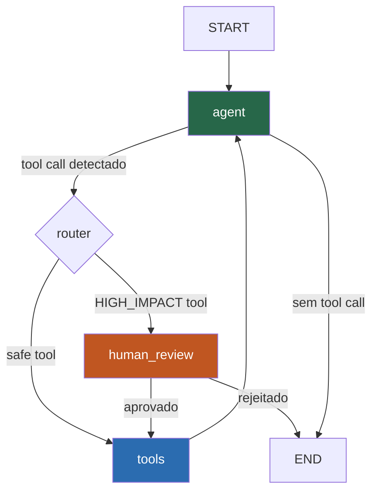

# agents-AI


Referência de padrões de produção para agentes de IA: **MCP server customizado**, **LangGraph HITL**, multi-provider (Ollama / Claude / OpenAI) e **evals com LLM-as-judge** — tudo em um único repositório executável.


> Screenshots desta página são da v0.1 do painel; a versão atual também inclui o agente HITL na sidebar com fluxo `interrupt → aprovação → resume`.

---

## MCP Server

`mcp_server.py` implementa um servidor MCP customizado com 4 ferramentas expostas via protocolo stdio — conectável ao **Claude Desktop**, **Claude Code** e qualquer cliente MCP compatível.

| Ferramenta | O que faz |
|---|---|
| `get_current_datetime` | Data/hora UTC em ISO 8601 |
| `calculate` | Avalia expressões matemáticas com segurança |
| `search_knowledge` | Busca no knowledge base (stub — conecte ao seu Qdrant) |
| `count_tokens` | Estimativa de tokens em um texto |

**Para rodar o servidor:**
```bash
pip install -r requirements.txt
python mcp_server.py
```

**Para conectar ao Claude Desktop**, adicione em `claude_desktop_config.json`:
```json
{
  "mcpServers": {
    "agents-ai": {
      "command": "python",
      "args": ["/caminho/para/mcp_server.py"]
    }
  }
}
```

> Em 2026, 78% dos times enterprise têm pelo menos um agente MCP em produção. Consumir MCP é commodity — *implementar* um servidor MCP é raro.

---

## Arquitetura do agente com ferramentas (LangGraph)


```mermaid
graph TD
    START --> agent
    agent -->|"tool call detectado"| router{router}
    router -->|"HIGH_IMPACT tool"| human_review
    router -->|"safe tool"| tools
    human_review -->|"aprovado"| tools
    human_review -->|"rejeitado"| END
    tools --> agent
    agent -->|"sem tool call"| END

    style human_review fill:#c05621,color:#fff
    style tools fill:#2b6cb0,color:#fff
    style agent fill:#276749,color:#fff
```

| Componente | Responsabilidade |
|---|---|
| **agent** | Invoca LLM com ferramentas vinculadas (LCEL + bind_tools) |
| **router** | Verifica se o tool call é de alto impacto |
| **human_review** | `interrupt()` — pausa, aguarda aprovação, retoma via `Command(resume=...)` |
| **tools** | `ToolNode` — executa a ferramenta e retorna o resultado ao agente |

---

## Agentes disponíveis

| Agente | Descrição | Padrão |
|---|---|---|
| Básico | Responde perguntas gerais | LCEL chain simples |
| Com Memória | Mantém contexto da conversa | `RunnableWithMessageHistory` |
| Com Ferramentas | Executa tools (soma, data atual) | `create_react_agent` (LangGraph) |
| RAG | Consulta documentos em `data/docs/` | LCEL RAG chain + FAISS |
| **HITL** | Pausa para aprovação em ações de alto impacto | LangGraph `interrupt()` + `MemorySaver` |


> Modo "Comparar Todos" do painel: três agentes respondendo à mesma pergunta em paralelo — útil para demonstrar diferença de comportamento entre LCEL puro, memória e RAG sem trocar de tela.

---

## Providers suportados

| Provider | Modelo padrão | Requer |
|---|---|---|
| `ollama` | `qwen3:8b` | [Ollama](https://ollama.ai) instalado |
| `claude` | `claude-haiku-4-5-20251001` | `ANTHROPIC_API_KEY` no `.env` |
| `openai` | `gpt-5-mini` | `OPENAI_API_KEY` no `.env` |

> Defaults escolhidos para 2026: Haiku 4.5 (rápido e barato na família Claude 4.x), GPT-5 mini (mid-tier OpenAI com tool-calling estável), Qwen3 8B (melhor tool-calling open-weight em 8B segundo benchmarks 2026, roda em laptop com 8 GB RAM). Trocar é uma constante em [`agents/provider.py`](agents/provider.py).

---

## Estrutura

```text
.
├── main.py                   # Dashboard Streamlit
├── mcp_server.py             # Servidor MCP customizado (stdio transport)
├── agents/
│   ├── provider.py           # Fábrica de LLMs por provider
│   ├── basic_agent.py        # LCEL chain simples
│   ├── memory_agent.py       # RunnableWithMessageHistory
│   ├── tool_agent.py         # LangGraph ReAct + tools
│   ├── rag_agent.py          # LCEL RAG + FAISS
│   └── hitl_agent.py         # LangGraph interrupt() + MemorySaver ← novo
├── evals/
│   ├── evaluate.py           # Harness LLM-as-judge
│   └── dataset.json          # Dataset de regressão
├── data/docs/                # Coloque seus .txt aqui para o agente RAG
├── requirements.txt
└── LICENSE
```

---

## Quick start

```bash
git clone https://github.com/RenanMiqueloti/agents-AI.git
cd agents-AI
python -m venv .venv
# Windows: .venv\Scripts\activate | Linux/Mac: source .venv/bin/activate
pip install -r requirements.txt
```

Crie `.env` com as chaves que for usar:

```env
ANTHROPIC_API_KEY=sk-ant-...
OPENAI_API_KEY=sk-...
```

```bash
# Ollama: garanta que o modelo de chat e o de embeddings estão disponíveis
ollama pull qwen3:8b
ollama pull nomic-embed-text   # embeddings dedicados para o agente RAG

# Painel Streamlit
streamlit run main.py

# HITL demo (terminal)
python -m agents.hitl_agent

# Evals
python -m evals.evaluate
```

---

## Evals

O harness em `evals/evaluate.py` avalia cada agente com LLM-as-judge em três dimensões:

| Dimensão | O que mede |
|---|---|
| `correctness` | A resposta está factualmente correta? |
| `helpfulness` | A resposta realmente ajuda o usuário? |
| `conciseness` | A resposta é breve sem perder informação? |

Os resultados são salvos em `evals/results.json` para rastreamento de regressão.

---

## Deploy live (Hugging Face Spaces)

O painel Streamlit roda no [free tier do Hugging Face Spaces](https://huggingface.co/spaces) sem precisar de GPU — setup em ~5 min:

1. Crie um Space em [huggingface.co/new-space](https://huggingface.co/new-space) → SDK **Streamlit** → visibilidade **Public**.
2. No `README.md` do Space, cole o frontmatter:
   ```yaml
   ---
   title: agents-AI
   emoji: 🔌
   colorFrom: blue
   colorTo: indigo
   sdk: streamlit
   sdk_version: 1.35.0
   app_file: main.py
   pinned: false
   license: mit
   ---
   ```
3. Faça push deste repo para o remote do Space (ou ative o **Sync from GitHub** na UI).
4. Em **Settings → Variables and secrets**, adicione `ANTHROPIC_API_KEY`, `OPENAI_API_KEY` e opcionalmente `LANGFUSE_PUBLIC_KEY` / `LANGFUSE_SECRET_KEY` / `LANGFUSE_HOST`.
5. Aguarde o build (~3-5 min). O Space fica em `huggingface.co/spaces/{seu-user}/agents-AI`.

> **Limitação:** Ollama não roda em Spaces free — selecione `claude` ou `openai` na sidebar quando estiver hospedado. A versão local com `streamlit run main.py` continua suportando os três providers.

---

## Observability — Langfuse (opt-in)

Para tracing detalhado das execuções dos agentes — spans, custos por run, prompts/respostas, tokens, latência por nó do grafo — defina três variáveis no `.env`:

```env
LANGFUSE_PUBLIC_KEY=pk-lf-...
LANGFUSE_SECRET_KEY=sk-lf-...
LANGFUSE_HOST=https://cloud.langfuse.com   # opcional (default: cloud Langfuse)
```

Sem essas keys, todos os agentes funcionam idênticos, mas sem tracing. Com elas, todo `runnable.invoke(..., config=callbacks_config())` envia spans ao seu projeto Langfuse — incluindo as chains LCEL (`basic`, `memory`, `rag`) e o grafo `tool`. O agente `hitl` não é instrumentado por padrão (streaming + `interrupt()` exigem hook manual); o caminho para estender é o helper [`agents/provider.py:callbacks_config`](agents/provider.py).

[Free tier do Langfuse →](https://langfuse.com)

---

## Design decisions

**Por que LangGraph e não CrewAI?**
LangGraph venceu CrewAI em stars do GitHub em early 2026 por uma razão concreta: reducer-based state management. Cada nó declara como atualiza o estado; conflitos em execuções paralelas são resolvidos deterministicamente. CrewAI abstrai isso — útil em demos, problemático em produção com audit trail.

**Por que `interrupt()` e não polling?**
`interrupt()` serializa o grafo completo via checkpointer (MemorySaver em memória, PostgresSaver em produção). A execução retoma do ponto exato — não do início. Polling exigiria estado externo e re-execução parcial do grafo.

**Por que um servidor MCP customizado?**
Consumir MCP é commodity (78% das enterprises já têm agentes MCP em produção). *Implementar* um servidor MCP é raro. Este projeto demonstra os dois lados do protocolo.

**Por que FAISS no agente RAG e não Qdrant?**
FAISS é embeddable (zero serviço externo) e suficiente para o caso de uso aqui: corpus estático em `data/docs/`, indexação em memória no startup, sem filtros nem escala horizontal. Mantém o quick-start em um único `pip install`. Quando o caso exige corpus dinâmico, retrieval híbrido e produção, o projeto irmão [`rag-chatbot`](https://github.com/RenanMiqueloti/rag-chatbot) usa Qdrant — separação intencional entre os dois repositórios.


> RAG agent extraindo número específico do `data/docs/exemplo.txt` — resposta ancorada no contexto recuperado, não inventada pelo LLM.
